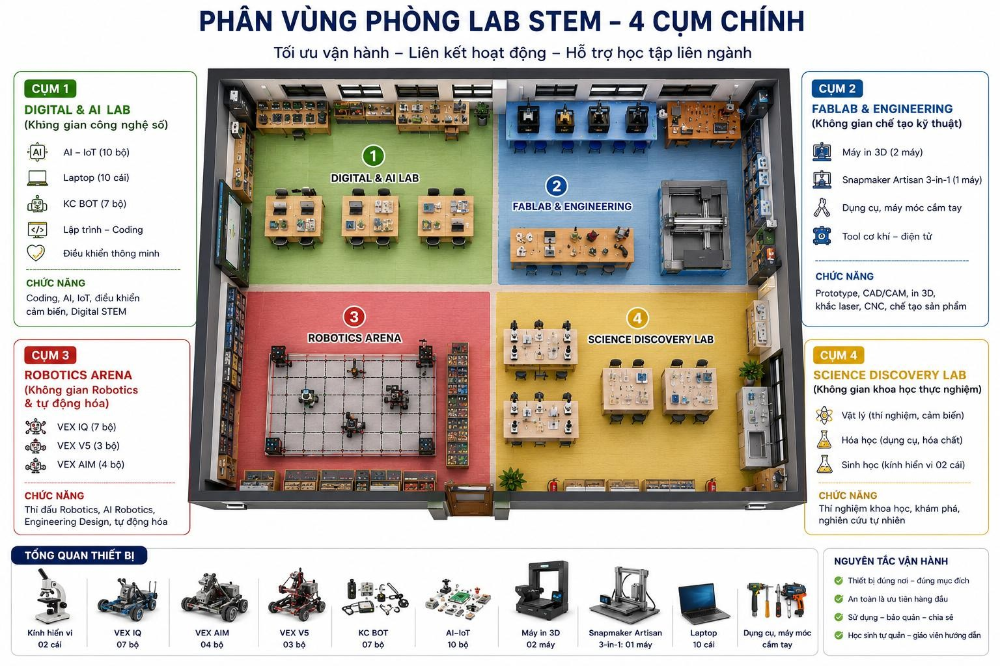

Giáo viên đang không đặt lịch mượn được, chỉ có học sinh mượn 
Giáo viên đang không phản hồi được
Chọn ngày đang không thuận tiện, nhích từng ngày một. Không khóa lịch trong quá khứ để đỡ mất thời gian và hạn chế khả năng sửa chữa => không cho tác động vào trong quá khứ, lịch mượn không chạy ngược , chỉ xem được nhưng không cho tác động nữa
Cần từ chối tự động với lịch đã qua hoặc do nhầm lẫn hoặc cố ý tạo lịch giả
Nếu có thể thì thêm dấu thời gian đăng ký, nhưng đăng ký phải trước 24h mới được duyệt. Trường hợp cấp bách thì đăng ký trực tiếp hoặc có mục GẤP, tạo thói quen mượn có kế hoạch, không ngẫu hứng
Bộ dụng cụ thiết bị nên hiện số lượng bận và số lượng còn trống, khi mượn có thể cho đăng ký số lượng mượn luôn
Với máy đắt tiền và có ít máy có thể đánh số máy 1, máy 2 để xác định là mượn và dùng máy nào
trên giao diện của học sinh, mượn nhiều khu và thiết bị hiện như trên cũng khá rõ ràng chỉ có điều phải thao tác mượn nhiều lần, có thể rút ngắn thao tác tick mượn nhưng vẫn giữ giao diện này không?
Trong khi đó, giao diện của người duyệt đang rất nhiều dòng, phải nhìn kỹ mới biết cùng ngày giờ, cùng đối tượng, đây là chưa có người khác xen vào, nên bố trí lại giao diện này để ra các thông tin mượn của cùng một đối tượng mượn trong 1 khung giờ trong 1 đoạn thông tin thôi
phần danh sách lịch đăng ký tốt nhất là duyệt từng khung giờ từng mục nhưng hơi tản mác  và duyệt nhiều, các dựu án lẫn vào nhau
phần nhìn cần cải tiến, nhìn xem ai mượn cái gì không rõ ràng, một nhóm mượn nhiều thứ nhưng phải duyệt nhiều chỗ, mỗi cái một nơi không tập trung
nếu có ai mượn 1 bộ tua vít thì các bộ khác được cho mượn như thế nào, hiện thị trên giao diện ra sao?
Nếu trường hợp Giao diện ko hiển thị được thì ko ghi nhận được hiệu suất sử dụng thật vì có thể nhóm đó sẽ mượn bằng miệng tại phòng thì giải quyết như nào?
giả sử 3 máy in thì phục vụ được 3 nhóm nhưng như giao diện thì chỉ phục vụ đc 1 nhóm, nếu cho nhóm khác đồng hoạt động mà ko lên hệ thống thì bị coi là ngoài luồng và nếu có hỏng hóc thì trợ lý tự chịu. Trường hợp này giải quyết sao?
còn nếu đợi lên hệ thống được mới cho học sinh dùng thì làm giảm năng suất phục vụ Hoặc tin vào đăng ký hiện theo thứ tự các khung giờ mượn 
đổi background sang màu xanh đen
Tạo ra một giao diện cho quản trị viên để thêm các thiết bị. Mặc định sẽ có các thiết bị như sau: thiết bị gồm có: 1. kính hiển vi 02 cái; 2. Vex IQ (7 bộ); 3. Vex AIM (4 bộ); 4. Vex V5 (3 bộ); 5. Bộ KC BOT (7 bộ); 6. Bộ học tập AI- IOT: 10 bộ; 7.  Máy in 3D: 2 máy; 8. Máy Snapmaker Artisan 3 trong 1: 1 máy; 9. Latop: 10 cái; 10. Dụng cụ, máy móc cầm tay
có vấn đề là không cần cho khu vực cơ khí vào lựa chọn. Vì khi sử dụng khu vực này sẽ quản lí bằng cách đặt thẻ và phải có giám sát của giáo viên và nó còn có nhiều dụng cụ nhỏ lắt nhắt và khi đến giờ đóng của nhưng hs vẫn đang cần dùng thiết bị ấy để làm tiếp dự án thì có phần lựa chọn đang sử dụng hoặc thiết bị đó bị lỗi thì cũng có chỗ chọn là đang bị lỗi thiết bị hoặc lỗi dự án để gv có thể kịp thời hỗ trợ và có phần ghi chú để học sinh miêu tả lỗi.
có 1 vấn đề nữa là chị muốn có thêm mục đánh giá các nhóm sau thi thực hiện. Chỉ cần các nút tốt, đạt và chưa đạt và có ô ghi chú
