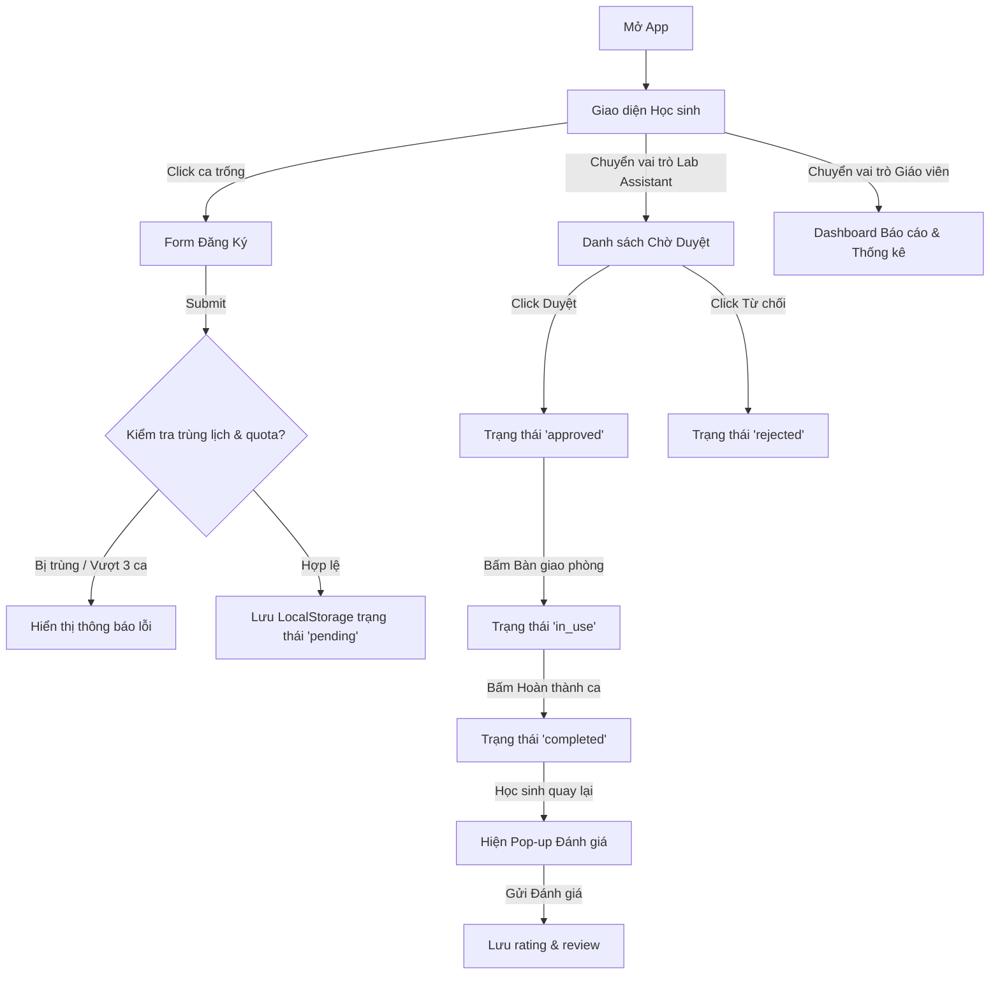

# 📐 TECHNICAL SPECIFICATION: stem-lab (Smart Lab Management System)

## 1. Executive Summary
Hệ thống quản lý phòng STEM (stem-lab) là một Single Page Application (SPA) viết bằng HTML, CSS và JavaScript thuần. Hệ thống số hóa toàn bộ quy trình từ xem lịch biểu theo 4 Zone, đặt lịch biểu trực tuyến (có kiểm tra tự động quota và trùng lịch), duyệt/bàn giao phòng bởi Lab Assistant, cho đến đánh giá trải nghiệm và hiển thị biểu đồ thống kê cho Giáo viên.

---

## 2. Tech Stack
- **Frontend Core:** HTML5, CSS3, ES6 JavaScript.
- **Styling:** Vanilla CSS (Glassmorphism, CSS Variables, Responsive Grid, Smooth Animations).
- **Libraries:** Chart.js (CDN) cho Dashboard thống kê.
- **Database & Storage:** LocalStorage (lưu trữ và đồng bộ dữ liệu cục bộ).

---

## 3. Database Schema (LocalStorage JSON Structure)

Ứng dụng lưu trữ các khóa sau trong `localStorage`:

### `stem_lab_bookings` (Danh sách các lượt đăng ký)
```json
[
  {
    "id": "book_1716652800000",
    "team_name": "VEX Team 12A1",
    "representative": "Nguyễn Văn A",
    "zone": "green", 
    "date": "2026-05-26",
    "time_slot": "07:00-09:00",
    "devices": ["Robot Kit VEX"],
    "purpose": "Lắp ráp cánh tay robot",
    "status": "approved", 
    "created_at": "2026-05-26T01:00:00Z",
    "rating": 5,
    "review": "Phòng sạch sẽ, thiết bị hoạt động tốt!"
  }
]
```

### `stem_lab_devices` (Danh sách thiết bị có sẵn)
```json
[
  {"id": "dev_1", "name": "Robot Kit VEX", "zone": "green", "status": "available"},
  {"id": "dev_2", "name": "Máy in 3D Ender", "zone": "red", "status": "available"},
  {"id": "dev_3", "name": "Bộ linh kiện Arduino", "zone": "yellow", "status": "available"}
]
```

---

## 4. Logic Flowchart (Mermaid)



---

## 5. Rules & Quota Constraints
1. **Trùng lịch:** Không được phép có hai lượt đặt có cùng `zone`, `date` và `time_slot` mà trạng thái không phải `rejected`.
2. **Định mức (Quota):** Mỗi `team_name` chỉ được đặt tối đa 3 ca (`status` khác `rejected`) trong cùng một tuần (Xác định theo tuần của ngày đăng ký `date`).
3. **Thời gian mỗi ca:** Tối đa 2 tiếng (các slot cố định: 07:00-09:00, 09:00-11:00, 13:30-15:30, 15:30-17:30, 17:30-19:30).

---

## 6. UI Components
- **Header:** Chứa tiêu đề, logo STEM Lab và **Role Switcher Widget** (Học sinh | Lab Assistant | Giáo viên).
- **Học sinh View:** 
  - Xem lịch Grid 4 cột (Green Zone, Yellow Zone, Red Zone, Open Lab) và các khung giờ hàng dọc. Các ô hiển thị: Trống (click để đặt), Chờ duyệt (vàng), Đã duyệt (xanh lá), Đang sử dụng (xanh dương), Đã xong (xám).
  - Modal Form Đăng Ký.
  - Modal Form Đánh Giá.
- **Lab Assistant View:** 
  - Tab quản lý yêu cầu đăng ký (Chờ duyệt, Đã duyệt, Đang sử dụng, Lịch sử). Các nút thao tác nhanh: Duyệt, Từ chối, Bàn giao, Trả phòng.
  - Tab quản lý thiết bị cơ bản.
- **Giáo viên View:** 
  - Biểu đồ tần suất hoạt động theo ngày (Thứ 2 - Chủ Nhật) bằng Chart.js.
  - Biểu đồ tròn phân bố sử dụng theo Zone bằng Chart.js.
  - Bảng top 5 nhóm hoạt động nhiều nhất.
